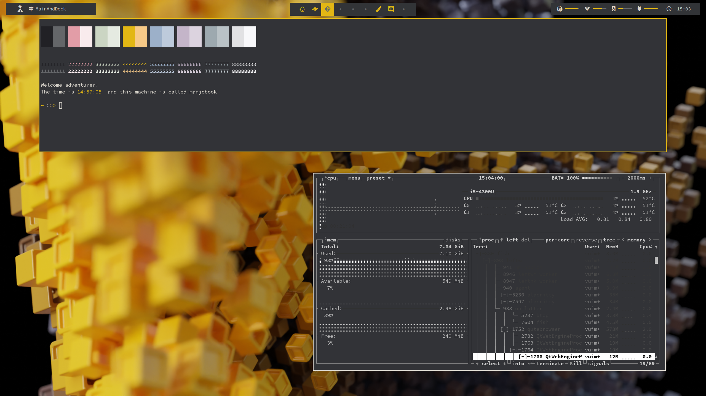
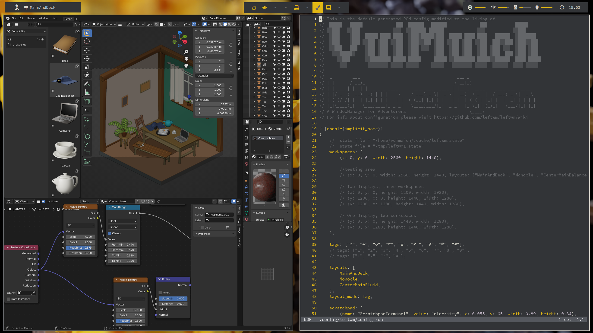

# LeftWM Community Themes

LeftWM is a window manager built around the idea of themes.
Here you can share your theme with the community for others to enjoy.
See what others created.

## Sharing your theme

Please consider sharing your theme for others to see. Just make a pull request and we will work with you to get your theme included.
If you need help creating a theme please refer to the themes guidelines and documentation [here.](https://github.com/leftwm/leftwm/tree/master/themes)
If you can't find what you are looking for please ask We want to help.

In addition to the standard guidelines for themes we ask that you also include a screenshot so others can see your hard work.

## Themes

Screenshots of the themes currently available:

### Amber

### arch-one-dark

### Ascent

### Blood Moon 

### Blue Coffee

### Bumblebee

### Catppuccin

### Coffee

### Doublebar

### Dracula

### Epitaph

### Flamingo

### Forest

### Garden

### Ground Zero

### Minimal Solarized

### Molese

### Ocean Night

### Orange Forest

### Plan9

### Red Moon

### Serika

### Soothe

### SpaceJelly

### Sunflower

### Sunset

### TNG

### Windows XP

### Zexanima

## LICENSE

This project is licensed under the BSD 3-Clause License.
Unless you explicitly state otherwise, any contribution intentionally submitted for inclusion in LeftWM by you, shall be licensed as BSD 3-Clause License, without any additional terms or conditions.
